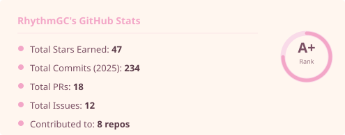
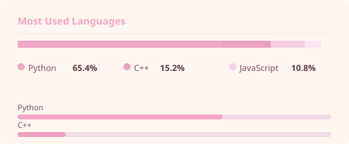
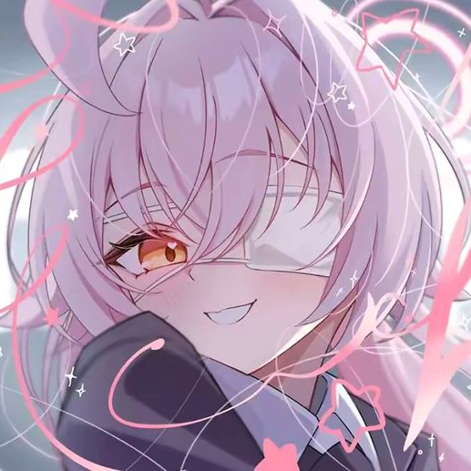
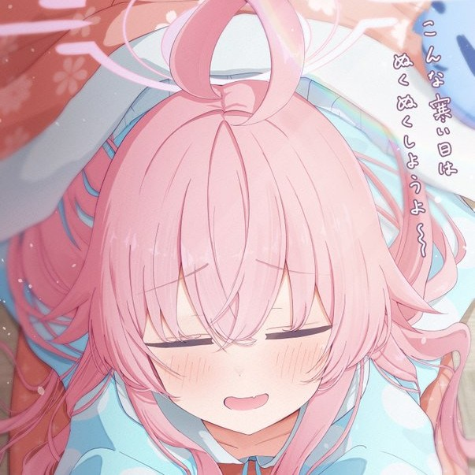
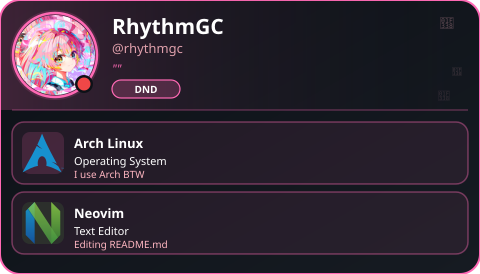

  

  

  
  

<!-- 

  

  <table border="0">
    <tr>
      <td align="center" style="border: none;">
        <i style="color: #f3a6c7; font-size: 1.2em;">"Uhee~ The sun is too bright today, isn't it? Let's find a cool place to sleep..."</i>
      </td>
    </tr>
  </table>

 -->

  

  
  
  
  
  
  
  

  

  <table border="0">
    <tr>
      <td style="border: none;">
        <ul style="list-style-type: none; padding: 0;">
          <li>🔭 Currently working on Some AI Projects  (When not napping)</li>
          <li>🌱 Learning AI to help the Abydos Foreclosure Task Force</li>
          <li>👯 Open to collaborate on **AI & Machine Learning**</li>
          <li>💬 Ask me about **AI, Arch Linux, or why Hoshino is the best**</li>
          <li>⚡ Fun fact: **I can sleep anywhere, just like my Oji-san**</li>
        </ul>
      </td>
    </tr>
  </table>

  

<table border="0" style="background-color: #f3a6c733; border: 2px solid #f3a6c7; border-radius: 16px; border-collapse: separate; padding: 8px; width: 100%; max-width: 1100px;">
  <tr>
    <td align="center" valign="middle" width="60%" style="border: none; padding: 8px;">
      
       
      
    </td>
    <td align="center" valign="middle" width="40%" style="border: none; padding: 8px;">
      
    </td>
  </tr>
</table>

 

  
   
  <table border="0" style="background-color: #f3a6c71f; border: 2px solid #f3a6c7; border-radius: 16px; border-collapse: separate; width: 100%; max-width: 1100px;">
    <tr>
      <td align="center" valign="middle" width="35%" style="border: none; padding: 12px;">
        
      </td>
      <td align="center" valign="middle" width="65%" style="border: none; padding: 12px;">
        
      </td>
    </tr>
  </table>

